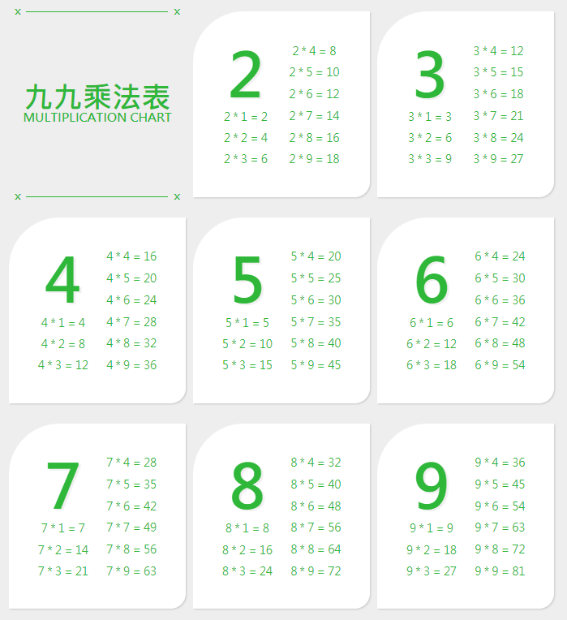

# 1F－九九乘法表





## [DEMO](https://ping12241.github.io/JS15/1F/)

## 預設SCSS


整體文字顏色皆為綠色


### @extend 

> 可將相同樣式整理在一起，透過「%」加上自己命名要合併樣式的名稱。設定如下：

SCSS

```css
%color {
    color: #2EB738;
}

.title {
    @extend %color;
}

.formula {
    @extend %color;
}
```

編譯後的CSS

```css
.title, .formula {
  color: #2EB738;
}
```


可避免一直繁瑣寫相同的樣式，當要更改整體色彩時也不用一塊一塊找！

簡單來說其實就是逗號選擇器啦～


> 參考網址：[https://ithelp.ithome.com.tw/articles/10128359](https://ithelp.ithome.com.tw/articles/10128359)

## 標題

### HTML

```markup
<span class="line"></span>
<div class="title">
     <h1>九九乘法表</h1>
     <h2>MULTIPLICATION CHART</h2>
</div>
<span class="line"></span>
```

### SCSS

> 利用偽元素 `::before, ::after`呈現4個 x 及橫線
>
> 參考網址：[https://www.oxxostudio.tw/articles/201706/pseudo-element-1.html](https://www.oxxostudio.tw/articles/201706/pseudo-element-1.html)

```css
.line {
    width: 80%;
    height: 1px;
    margin: 0 auto;
    position: relative;
    background-color: #2EB738;
    font-weight: bold;
    font-size: 20px;
    
    &::before {
        content: 'x';
        position: absolute;
        top: -15px;
        left: -8%;
        @extend %color;
    }

    &::after {
        content: 'x';
        position: absolute;
        top: -15px;
        right: -8%;
        @extend %color;
    }
}
```


Scss中 「&」表示父元素。


編譯後的CSS

```css
.line::before, .line::after {
  color: #2EB738;
}

.line::before {
  content: 'x';
  position: absolute;
  top: -15px;
  left: -8%;
}

.line::after {
  content: 'x';
  position: absolute;
  top: -15px;
  right: -8%;
}
```

## 乘法表


裡面數字需使用JS for迴圈印出，不可直接在HTML打數字。


### SCSS

* 區塊設計

```css
.box {   //每格大小包含標題區塊
    width: 350px;
    height: 366px;
    margin-bottom: 40px;
}

.formula {   //數字區塊
    background-color: white;
    border-radius: 100px 0px 30px 0px;
    box-shadow: 2px 2px 3px #cecece;
    @extend %color;
}
```

* 數字區塊設計

```css
.list__title {　　//標題數字
    font-size: 120px;
    line-height: 120px;
    font-weight: bold;
    text-shadow: 4px 3px 0px #f0f0f0;
}

.list__item {　　//每一個運算式
    font-size: 22px;
    line-height: 32px;
}
```

### JS

> 為了讓內容乖乖對應每一塊白色區塊，所以先不寫HTML，直接透過JS迴圈添加白色區塊和數字。

* 對應到要擺在HTML的位置

```javascript
var wrap = document.querySelector(".content");
```

#### querySelector\( \)－取得第一個元素

> 記得要加「.」或「\#」才知道是哪個CSS屬性！  
> 而要取得所有元素可使用 **`querySelectorAll( )`**

* 新增一個div標籤並給它指定屬性（迴圈表示跑2~9次，也就是添加8個div）。

```javascript
for (var i = 2; i < 10; i++) {
    var box = document.createElement("div");
    box.setAttribute("class", "box formula");
    wrap.appendChild(box);
}
```

#### createElement\( \)－新增標籤

#### setAttribute\( \)－添加指定屬性

> `setAttribute(" 屬性 ", " 名稱 " )`  
> 若是只新增class可直接使用 **`classList.add(" 名稱 ")`**

#### appendChild\( \)－附加到某元素

目前HTML

```markup
<div class="content">
    <div class="box formula">
    
    </div>
</div>
```

* 數字標題以此類推

```javascript
for (var i = 2; i < 10; i++) {   
    var list = document.createElement("ul");
    list.classList.add("list");
    box.appendChild(list);
    var list__title = document.createElement("li");
    list__title.classList.add("list__title");
    list__title.textContent = i;
    list.appendChild(list__title);
}
```

#### textContent－純文件內容

> 和innterHTML不同於**`inntetHTML`可讀標籤屬性**。

* 接下來就是本題重點－變數使用

```javascript
for (var j = 1; j <= 9; j++) {
     var list__num = document.createElement("li");
     list__num.classList.add('list__item');
     list__num.textContent = `${i} * ${j} = ${i * j}`;
     list.appendChild(list__num);
}
```

> 「 \` 」 為鍵盤左上角～那顆，和「${ }」都是配合變數使用。  
> 表示每一次新增的`li`標籤裡面的文字內容數字皆不同  
> 最後把它附加回`ul`就大功大成啦！

## 完整原始碼



```markup
<body>
    <div class="wrapper">
        <div class="content">
            <div class="box header">
                <span class="line"></span>
                <div class="title">
                    <h1>九九乘法表</h1>
                    <h2>MULTIPLICATION CHART</h2>
                </div>
                <span class="line"></span>
            </div>
        </div>
    </div>
    <script src="js/js.js"></script>
</body>
```



```javascript
window.onload=num;　//當頁面載入時執行num

function num() {
    var wrap = document.querySelector('.content');
    for (var i = 2; i < 10; i++) {   
        var box = document.createElement("div");
        box.setAttribute("class", "box formula");
        wrap.appendChild(box);
        var list = document.createElement("ul");
        list.classList.add("list");
        box.appendChild(list);
        var list__title = document.createElement("li");
        list__title.classList.add("list__title");
        list__title.textContent = i;
        list.appendChild(list__title);
        for (var j = 1; j <= 9; j++) {
            var list__num = document.createElement("li");
            list__num.classList.add('list__item');
            list__num.textContent = `${i} * ${j} = ${i * j}`;
            list.appendChild(list__num);
        }
    }
}
```



## 檢核表

* [x] SCSS
* [x] 利用JS for迴圈跑數字

